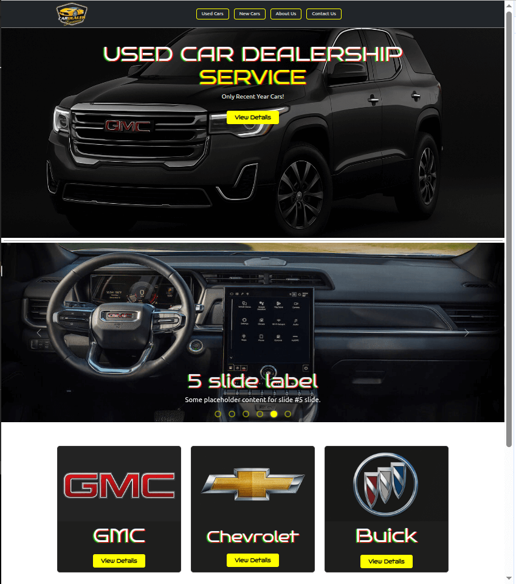
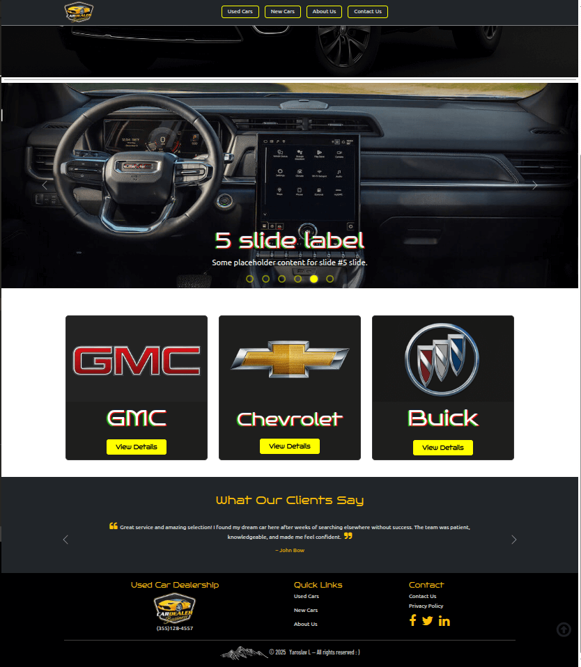
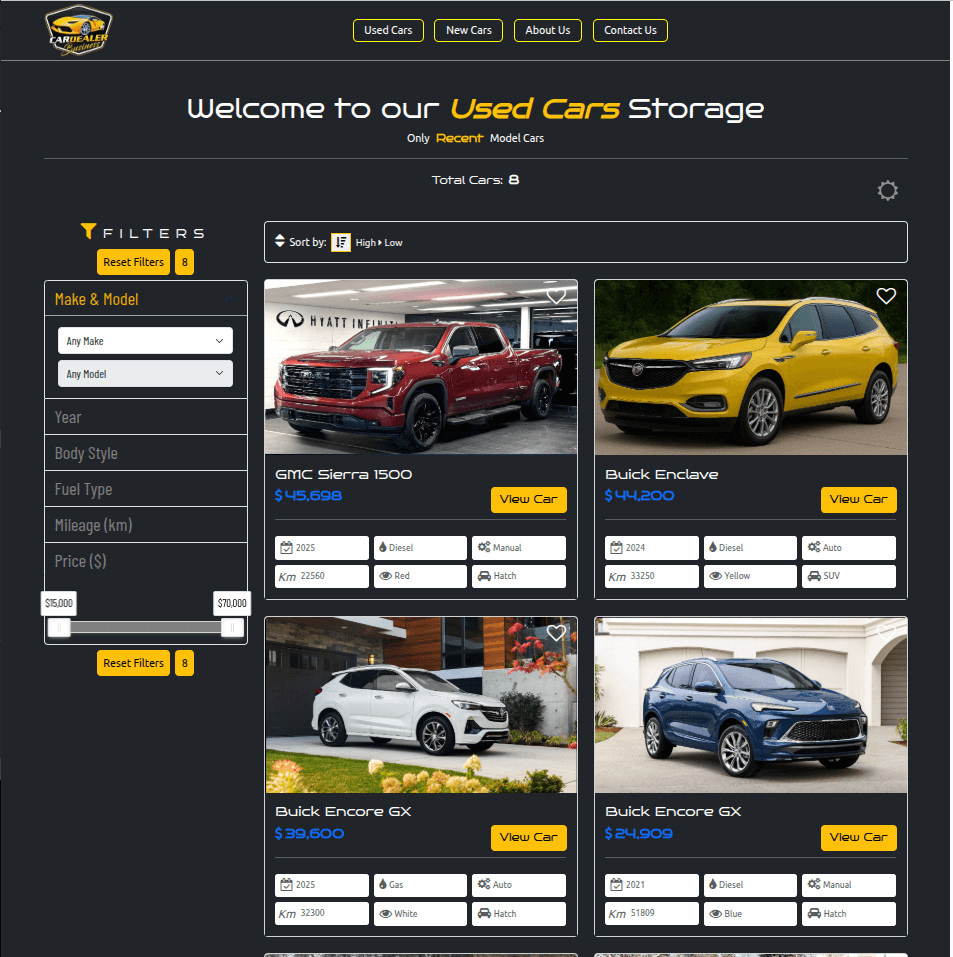
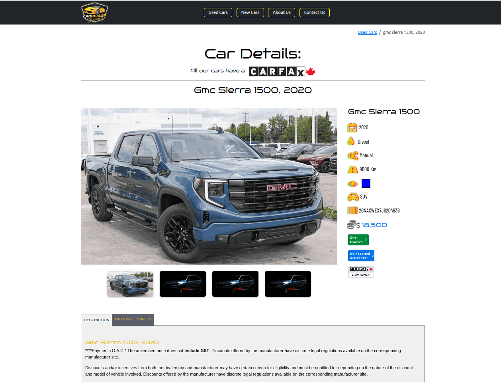
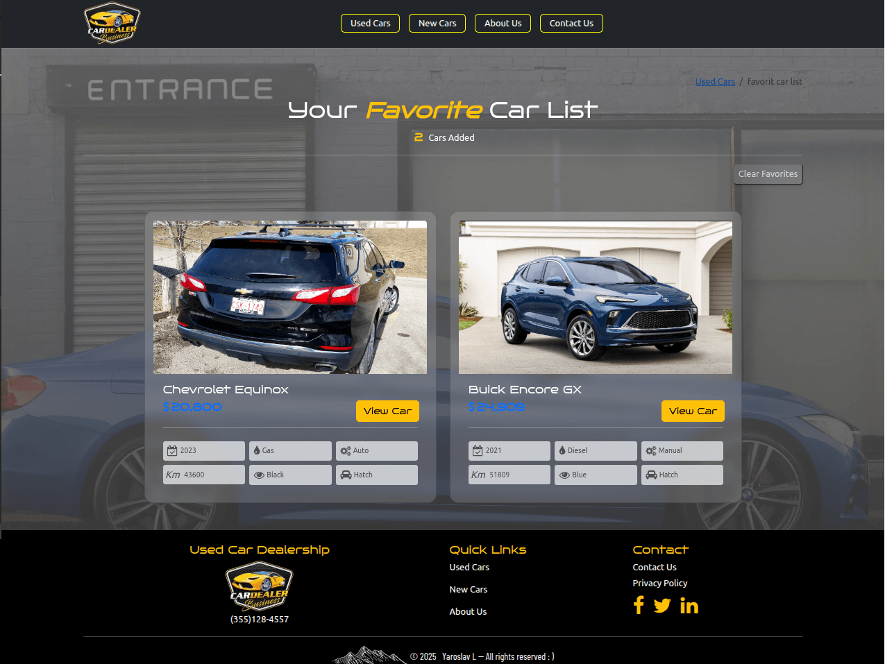
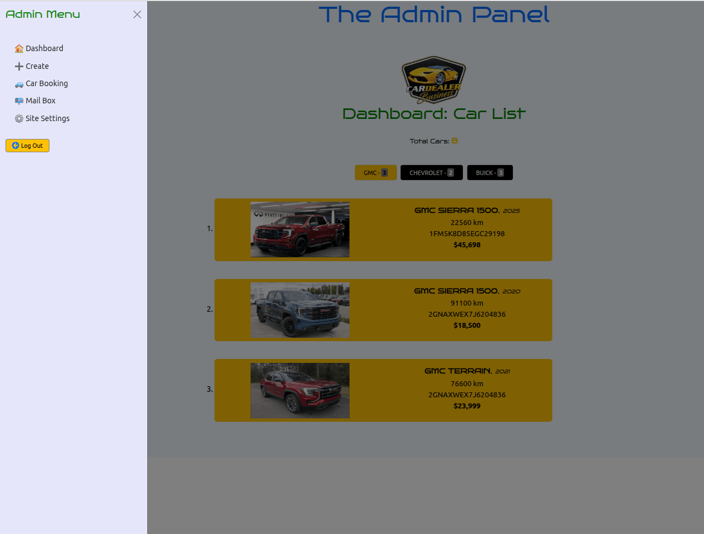
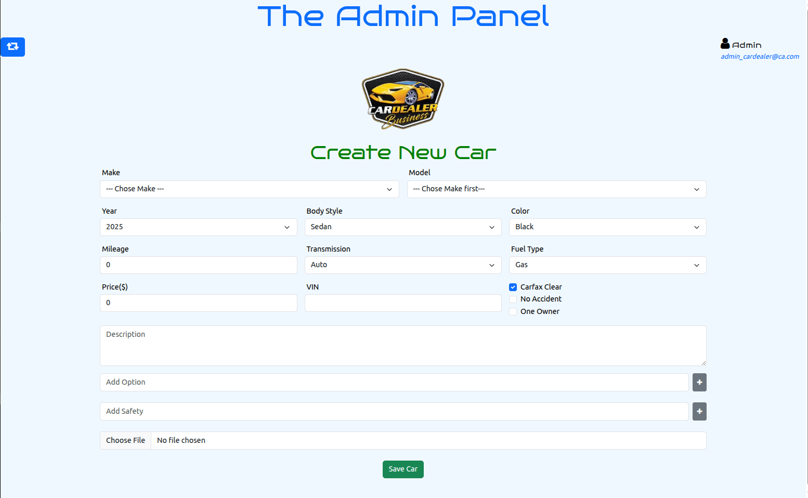

# React + TypeScript + Vite
This template provides a minimal setup to get React working in Vite with HMR and some ESLint rules.
Currently, two official plugins are available:
- [@vitejs/plugin-react](https://github.com/vitejs/vite-plugin-react/blob/main/packages/plugin-react) uses [Babel](https://babeljs.io/) for Fast Refresh
- [@vitejs/plugin-react-swc](https://github.com/vitejs/vite-plugin-react/blob/main/packages/plugin-react-swc) uses [SWC](https://swc.rs/) for Fast Refresh

# 🚙 Used Car Dealership Service (GMC / Chevrolet / Buick)

**Only Recent Year Cars** → Vehicles not older than **5–7 years**.

---

## 📸 Preview

### 🏠 Home Page



### 🚘 Used Cars Platform (Filters + Sorting)


### 📑 Car Details Page


### 📑 Faforite Car List Page


### 🛠️ Admin Panel




## ⚙️ Tech Stack
- **Frontend**: React 19 + TypeScript  
- **State Management**: Redux Toolkit  
- **Database / Backend**: Firebase (Firestore, Authentication)  
- **Forms**: React Hook Form (validation + controlled inputs)  
- **UI & Styling**: Bootstrap 5, FontAwesome icons  
- **Routing**: React Router v6  
- **Other Libraries**: noUiSlider (double range slider), Framer Motion (animations, optional)  

---

## 📦 Packages
- `react-router-dom`  
- `firebase`  
- `redux`  
- `@reduxjs/toolkit`  
- `react-hook-form`  
- `bootstrap`  
- `font-awesome`

---

## 📘 API & Libraries
- **react-router-dom** → Routing for React (page navigation, links  without reloads)  
- **react-redux** → Store and State Management   
- **@reduxjs/toolkit** → Additional, not required BUT Official, recommended way to write Redux state logic with less code and more clear and readable  
- **react-hook-form** → A library to manage Forms in React with controlled inputs and  validation.
- **react-input-mask** → Provides input masking (like phone numbers, dates, et cetera...).
- **@fancyapps/ui** → Lightbox library for  gallery, modal windows, image/video popups).
- **nouislider** → Lightbox for adjustable slider like a range slider- I’ve used it as range-slider for my Price-Filter
- **firebase** → Google’s backend services - database, auth, hosting, storage.

---

## 🎯 Project Goal
Develop a **Used Car Dealership Web Application** that allows users to:
- Browse, filter, and sort vehicles you need
- Browse/view single car(details) with all info and Descriptions
- Book car to test drives and buy it
- Send messages/letters to DealerShip team(questions, complaints, wishes )
- Manage favorites cars (wishlist) - this’s a wish-list the client has added the cars he likes.
- Access data in real time from Firebase BD and Storage
For Administrator Project Goals are: 
- See all cars in the Admin Panel as a total list
- Be able to edit each car’s  details and delete it  if a vehicle has been sold for example or no longer needs to be displayed
- See all booking letters/messages  about a test drive or car purchase and be able to change their status- `PANDING` → `ANSWERED` like in Mail box. 
	And Delete letters/messages if there's no need for more.
- See all contact letters (feedback from ContactUs page) and be able to change their status  `NEW` → `ANSWERED`. 
	And Delete contacts letters if there's no need for more.

Focus: **recent cars (≤7 years old) - cars in good condition ** with a **modern, responsive UI**.

---

## 🖼️ Core Features

### 🔹 Pages
- **Home** → Banner, carousel slider, dealership info  
- **New Cars** → Showcase of new models  
- **Used Cars Platform** → Advanced filtering + sorting  
- **About Us** → Company information  
- **Contact Us** → Contact form with validation  

---

### 🔹 Filters (for Used Cars)
- **Make** → GMC, Chevrolet, Buick  
- **Model** → dynamic, depends on selected Make  
- **Year** → select range or exact year  
- **Body Style** → SUV, Sedan, Hatchback  
- **Color** → multi-choice/dropdown  
- **Transmission** → Auto / Manual  
- **Fuel Type** → Gas / Diesel  
- **Odometer** → range km/miles  
- **Price** → double slider (`10–25k`, `25–50k`, `50–75k`, `75k+`)  
- **Reset Filters** → Clear all filters  

✔️ All filters connected to Redux.  
✔️ On filter change → car list re-renders in real time.  

---

### 🔹 Sorting
- **Year** → Oldest → Newest / Newest → Oldest  
- **Price** → Lowest → Highest / Highest → Lowest  

---

### 🔹 Car Details & Booking
- **Car Details Page** → Image slider + specs + badges:  
  - ✅ CarFax  
  - ✅ No Accidents  
  - ✅ One Owner  

- **Favorites (Wishlist)**  
  - ❤️ Add/remove car IDs in `localStorage`  
  - Stored as array of IDs (or objects)  
  - **Favorites Page** → Renders all saved cars  

- **Book a Test Drive**  
  - Mini form: name, phone, email, preferred date  
  - Saved to Firebase  

- **Global Search** → Quick search by “Car Model” (e.g., *Chevrolet Malibu*)  

---

## 📘 ADMIN PANEL (CRUD with Redux)
🔒 **Restricted to Admins / SuperAdmins**

### Features:
1. **Create a Car Ad**
   - Car ID  
   - Make (Ford, BMW, Toyota, GMC…)  
   - Model → auto-updates from Make  
   - Year, Body Style, Color, Transmission, Fuel, Odometer, Price  
   - Description + Badges (CarFax / No Accident / One Owner → auto on front-end)  
   - Photos (main + 3 additional → displayed in slider)  

2. **Edit a Car Ad**  

3. **Delete a Car Ad**  

4. **Booking Car Management**  
   - View customer requests for test drives/purchases  
   - Update booking status: `pending → answered`  

5. **Contact Us Management**  
   - Customer questions & feedback  
   - Admin “Mailbox”  
   - Update “Mailbox” status: `new → answered`  

6. **Settings**  
   - Menu, pagination, site logo, social links, etc.  

---

## 🛠️ Setup & Run
```bash
# Install dependencies
npm install

# Run dev server
npm run dev

# Build for production
npm run build
